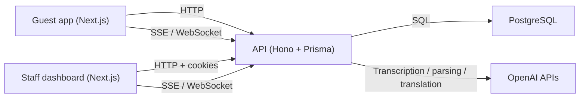

# Kurk AI

Kurk AI is a hotel room-service system with three connected surfaces: a guest tablet web app for voice or text requests, a staff dashboard for handling requests and operations, and an API that manages rooms, inventory, realtime events, reporting, and tablet pairing. Guests can ask for items like towels or water, staff can track and fulfil those requests in realtime, and management can review monthly operational data.

## Architecture



- `apps/web` is the guest experience served at the root route.
- `apps/dashboard` is the internal staff UI.
- `apps/api` is the backend for auth, rooms, inventory, requests, reporting, SSE, and WebSockets.
- PostgreSQL stores application and auth data through Prisma.

## Project Structure

```text
kurk-ai/
├── apps/
│   ├── api/                 # Hono API, Prisma schema, seeds, tests, auth, realtime, reports
│   ├── dashboard/           # Staff-facing Next.js app
│   └── web/                 # Guest-facing Next.js app
├── docs/                    # Extra project notes and reference material
├── scripts/                 # Repo-level helper scripts such as branch-name validation
├── .husky/                  # Git hooks for branch validation and commit linting
├── Dockerfile               # Multi-target container build for api, web, and dashboard
├── commitlint.config.cjs    # Conventional commit rules
├── package.json             # Workspace scripts and shared tooling
├── pnpm-workspace.yaml      # pnpm workspace definition
└── README.md                # Root onboarding and system documentation
```

Key app folders:

```text
apps/api/
├── prisma/                  # Prisma schema, seed script, and seed data
├── src/lib/                 # Env parsing, auth, db helpers, logging, realtime bus, websocket fanout
├── src/middlewares/         # Auth and room-session middleware
├── src/routes/              # Guest, staff, and admin HTTP routes
├── src/services/            # Request, inventory, room, reporting, stocktake, transcription logic
├── src/testing/             # Integration-style API tests
└── package.json             # API scripts

apps/dashboard/src/
├── app/                     # Next.js routes for requests, rooms, inventory, reports, auth
├── components/              # UI and domain components
├── hooks/                   # Query hooks, realtime hooks, sound alerts, keyboard shortcuts
└── lib/                     # DTOs, API client, validation, WebSocket manager

apps/web/src/
├── app/                     # Next.js guest route group and root layout
├── components/guest/        # Guest-specific UI such as orb, setup, requests, listening overlay
├── hooks/                   # Audio, wake word, SSE, transcription, translation hooks
└── lib/                     # Guest API client, language dictionary, DTOs, utilities
```

## Setup

1. Clone the repository.

```bash
git clone <your-repo-url>
cd kurk-ai
```

2. Install workspace dependencies.

```bash
pnpm install
```

3. Create local environment files from the examples.

```bash
cp apps/api/.env.example apps/api/.env
cp apps/web/.env.example apps/web/.env.local
cp apps/dashboard/.env.example apps/dashboard/.env.local
```

4. Start PostgreSQL and update `apps/api/.env` so `DATABASE_URL` points to it.

5. Generate and sync the Prisma schema.

```bash
pnpm --dir apps/api run db:generate
pnpm --dir apps/api run db:push
```

6. Seed the database.

```bash
pnpm --dir apps/api run db:seed
```

7. Start the applications.

```bash
pnpm --filter api dev
pnpm --filter web dev
pnpm --filter dashboard dev
```

Default local URLs:

- API: `http://localhost:3001`
- Guest app: `http://localhost:3000`
- Staff dashboard: `http://localhost:3002`

Useful repo commands:

```bash
pnpm lint
pnpm build
pnpm check
```

## Environment Variables

### API (`apps/api/.env`)

| Variable | Required | Description |
| --- | --- | --- |
| `PORT` | Yes | Port the Hono API listens on. |
| `ALLOWED_ORIGINS` | Yes | Comma-separated browser origins allowed by CORS. |
| `DATABASE_URL` | Yes | PostgreSQL connection string used by Prisma. |
| `TRUST_PROXY` | No | Whether the API should trust forwarded proxy headers. |
| `BETTER_AUTH_SECRET` | Yes | Secret used by Better Auth to sign and verify auth state. |
| `BETTER_AUTH_URL` | Yes | Public base URL for auth callbacks and cookie configuration. |
| `BETTER_AUTH_COOKIE_DOMAIN` | No | Shared cookie domain for multi-subdomain auth in production. |
| `OPENAI_API_KEY` | Yes for voice/AI features | API key for transcription, translation, and request understanding. |

### Guest app (`apps/web/.env.example`)

| Variable | Required | Description |
| --- | --- | --- |
| `NEXT_PUBLIC_API_BASE_URL` | Yes | Public base URL for guest app API requests. |

### Staff dashboard (`apps/dashboard/.env.example`)

| Variable | Required | Description |
| --- | --- | --- |
| `NEXT_PUBLIC_API_URL` | Yes | Public API base URL used by the dashboard HTTP client. |
| `NEXT_PUBLIC_WS_URL` | Yes | Public WebSocket URL used for staff realtime updates. |
| `NEXT_PUBLIC_AUTH_URL` | Yes | Public auth endpoint base used by dashboard auth flows. |

## API Reference

All API routes are rooted in `apps/api/src/routes`.

### Admin routes

These routes require admin auth.

| Method | Path | Parameters / Body | Response |
| --- | --- | --- | --- |
| `GET` | `/admin/rooms` | None | `{ rooms: RoomWithDevices[] }` |
| `POST` | `/admin/rooms/:roomId/pairing-code` | Path: `roomId` | `{ roomId, pairingCode, expiresAt }` |
| `DELETE` | `/admin/rooms/:roomId/pairing-code` | Path: `roomId` | `{ roomId, pairingCode: null, expiresAt: null }` |
| `PATCH` | `/admin/rooms/:roomId` | Body: `number?`, `code?`, `accessToken?`, `isActive?` | `{ room }` |
| `POST` | `/admin/rooms/:roomId/devices` | Body: `name`, `deviceFingerprint`, `isActive?` | `{ device }` |
| `PATCH` | `/admin/rooms/:roomId/devices/:deviceId` | Body: `name?`, `isActive?` | `{ device }` |
| `POST` | `/admin/rooms/:roomId/reset-history` | Path: `roomId` | `{ roomId, hiddenBefore }` |
| `POST` | `/admin/device-sessions/:sessionId/revoke` | Path: `sessionId` | `{ sessionId, revokedAt, roomId, roomDeviceId }` |
| `GET` | `/admin/device-sessions` | None | `{ sessions: RoomDeviceSessionSummary[] }` |

### Staff routes

These routes require staff auth.

| Method | Path | Parameters / Body | Response |
| --- | --- | --- | --- |
| `GET` | `/staff/requests` | None | `{ requests: GuestRequestSummary[] }` |
| `PATCH` | `/staff/requests/:requestId` | Body supports `status`, `rejectionReason`, `staffNote`, `etaMinutes`, `items[]` | `GuestRequestSummary` |
| `POST` | `/staff/requests/:requestId/eta/extend` | Body: `minutes?` | `GuestRequestSummary` |
| `GET` | `/staff/inventory` | None | `{ items: InventoryItemSummary[] }` |
| `POST` | `/staff/inventory` | Body: `sku`, `name`, `category`, `unit`, `quantityInStock`, `lowStockThreshold` | `InventoryItemSummary` |
| `PATCH` | `/staff/inventory/:inventoryItemId` | Body: mutable inventory fields | `InventoryItemSummary` |
| `POST` | `/staff/inventory/:inventoryItemId/restock` | Body: `quantity`, `note?` | Restock result payload |
| `POST` | `/staff/inventory/:inventoryItemId/adjustments` | Body: `quantityDelta`, `reason`, `note?` | Adjustment result payload |
| `GET` | `/staff/inventory/movements` | Query: `inventoryItemId?`, `requestId?`, `stocktakeSessionId?` | `{ movements: InventoryMovement[] }` |
| `GET` | `/staff/reports/monthly` | Query: `month=YYYY-MM` | `MonthlyReport` |
| `GET` | `/staff/events` | SSE stream | Connected event + subsequent realtime events |
| `GET` | `/staff/stocktakes` | None | `{ stocktakes: StocktakeSession[] }` |
| `POST` | `/staff/stocktakes` | Body: `note?` | `StocktakeSession` |
| `POST` | `/staff/stocktakes/:stocktakeId/lines` | Body: `lines[]` with `inventoryItemId`, `physicalCount`, `reason?` | `StocktakeSession` |
| `GET` | `/staff/stocktakes/:stocktakeId` | Path: `stocktakeId` | `StocktakeSession` |
| `POST` | `/staff/stocktakes/:stocktakeId/finalize` | Path: `stocktakeId` | `StocktakeSession` |

### Guest routes

| Method | Path | Parameters / Body | Response |
| --- | --- | --- | --- |
| `POST` | `/guest/device-sessions` | Body: `roomCode`, `pairingCode`, `deviceFingerprint`, `deviceName?` | `DeviceSessionResponse` |
| `DELETE` | `/guest/device-sessions/current` | Header auth via room device middleware | Revocation payload |
| `POST` | `/guest/transcribe` | Multipart form field `audio` | `{ transcript }` |
| `POST` | `/guest/realtime-transcription-session` | Raw SDP offer body | SDP answer body |
| `POST` | `/guest/parse-request` | Body: `rawText` | Parsed items, category, optional clarification |
| `POST` | `/guest/translate` | Body: `texts[]`, `language` | `{ translations: string[] }` |
| `GET` | `/guest/inventory/catalog` | None | `{ items: InventoryItemSummary[] }` |
| `GET` | `/guest/requests/current` | Header `x-room-session-token` or room token/code | Current room request payload |
| `GET` | `/guest/requests/history` | Same auth as above, query `limit?` | Room request history payload |
| `GET` | `/guest/events` | SSE stream with room auth in query/header | Connected event + room-scoped realtime events |
| `POST` | `/guest/requests/preview` | Body: `items[]` | Availability preview payload |
| `POST` | `/guest/requests` | Header `x-room-session-token`, body `source`, `rawText`, `items?`, `allowPartial?` | Created request summary |

## WebSocket and Realtime Events

The backend emits the same event types through:

- Server-Sent Events on `/staff/events` and `/guest/events`
- WebSocket fanout on `/ws?scope=staff` and `/ws?scope=guest&roomSessionToken=...`

WebSocket payload shape:

```json
{
  "type": "request.updated",
  "requestId": "req_123",
  "roomId": "room_123",
  "status": "in_progress",
  "occurredAt": "2026-04-17T08:00:00.000Z",
  "data": {}
}
```

Event catalog:

| Event | When it fires | Typical payload fields |
| --- | --- | --- |
| `connected` | Immediately after an SSE/WebSocket connection is accepted | `scope`, optional `roomId` |
| `request.created` | A guest request is created | `requestId`, `roomId`, request summary data |
| `request.updated` | A request changes state or note/ETA | `requestId`, `roomId`, `status` |
| `request.rejected` | A request is rejected or invalidated | `requestId`, `roomId`, `status`, reason data |
| `request.delivered` | A request is fully or partially delivered | `requestId`, `roomId`, `status` |
| `inventory.updated` | Inventory levels or metadata change | `inventoryItemId`, stock fields |
| `alert.low_stock` | An inventory item crosses its low-stock threshold | `inventoryItemId`, quantity data |
| `stocktake.finalized` | A stocktake session is finalized | `stocktakeId`, reconciliation summary |
| `room.session.created` | A room device session is created after pairing | `sessionId`, `roomId`, `deviceId` |
| `room.session.revoked` | Staff revokes a room tablet session | `sessionId`, `roomId` |
| `room.history.reset` | Staff hides old request history for a room | `roomId`, `hiddenBefore` |

## Git Workflow

This repository uses a production-style workflow:

- Never commit directly to `main`
- Create a branch per unit of work using:
  - `feature/<description>`
  - `fix/<description>`
- Keep commits focused to one logical change
- Use Conventional Commits:
  - `feat`
  - `fix`
  - `refactor`
  - `docs`
  - `test`
  - `chore`
- Keep `main` deployable at all times
- Husky and commitlint enforce branch naming and commit message format

Examples:

```text
feature/guest-voice-activation
fix/monthly-response-time

feat(web): add guest voice activation
fix(api): calculate monthly response time
docs(repo): expand onboarding guide
```
